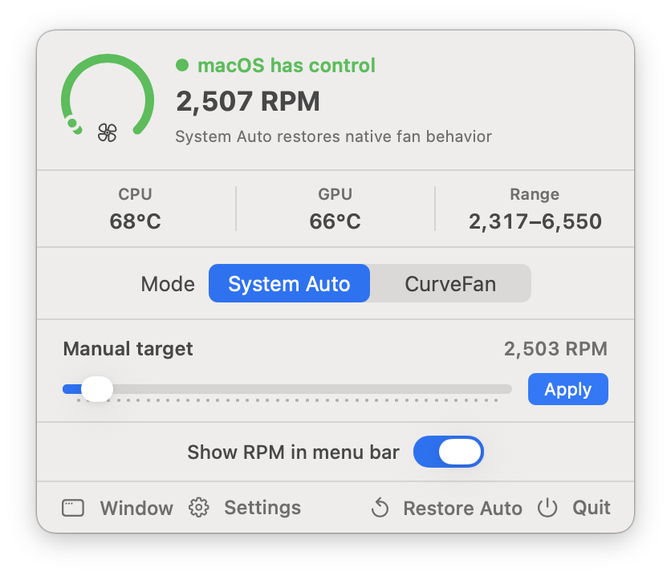
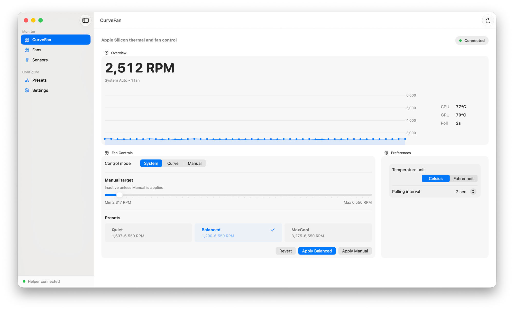

<div align="center">
  

  # CurveFan

  **Native macOS fan speed monitor and controller for Apple Silicon**

  
  
  
  
</div>

<div align="center">

English | [简体中文](README-zh.md)

</div>

---

<div align="center">
  
  &nbsp;&nbsp;
  
</div>

---

CurveFan sits in your menu bar and gives you direct control over fan speed through the SMC on Apple Silicon Macs. A privileged LaunchDaemon handles all hardware writes; the UI process stays unprivileged. macOS automatic fan control is always restored when you quit or select **System Auto**.

> **Warning** — CurveFan writes directly to SMC fan registers. Manual fan control carries thermal risk. Use with care.

## Tech Stack

| Layer | Technology |
|---|---|
| Language | Swift 6.4 (strict concurrency) |
| UI | SwiftUI + AppKit (NSStatusItem / NSPanel) |
| Charts | Swift Charts — RPM trend, fan curve preview |
| Hardware | IOKit `AppleSMC` — helper-side only |
| IPC | Unix socket · JSON · 4-byte length-prefixed framing |
| Build | Swift Package Manager |
| Tests | XCTest · no hardware required |

## Features

- **Menu bar panel** — live RPM gauge, CPU/GPU temperatures, fan range
- **System Auto** — one click restores macOS native fan control
- **Fan curve presets** — Quiet, Balanced, MaxCool with real-time SMC writes
- **Manual RPM** — fixed target with hardware bounds clamping
- **Batch SMC reads** — all temperature keys fetched in a single IPC round trip
- **Wake-event recovery** — re-applies manual settings after system sleep
- **Apple Silicon M1–M5** — generation-aware SMC key database and unlock sequences

## Architecture

```
CurveFanCore (library)      ← shared models, IPC types, SMC decoder, presets
    ├── CurveFan (SwiftUI)  ← unprivileged UI process, talks over Unix socket
    └── CurveFanHelper      ← root LaunchDaemon, sole SMC / IOKit contact
```

The app never touches the SMC directly. Every hardware operation crosses a Unix socket as a length-prefixed JSON command. The helper validates all inputs (key format, fan index, RPM range) before writing.

## Requirements

- Apple Silicon Mac (M1 or later) with at least one controllable fan
- macOS 26.0 or newer
- Administrator access (for privileged helper installation on first launch)

## Install

Download the latest DMG from [Releases](https://github.com/BeastOrange/CurveFan/releases).

1. Open the DMG and drag **CurveFan.app** to your Applications folder.
2. Double-click **CurveFan.app**.
3. On first launch, CurveFan will ask to install its privileged helper — click **Install Helper** and enter your password.
4. Done. The helper starts automatically at login from this point on.

If macOS says the app is damaged or can't be opened:

```bash
sudo xattr -cr /Applications/CurveFan.app
```

## Build from Source

```bash
git clone git@github.com:BeastOrange/CurveFan.git && cd CurveFan

swift build                   # debug build, all targets
swift test                    # unit tests (no hardware required)
bash build_app.sh release     # bundle .build/release/CurveFan.app
bash build_dmg.sh 1.0.0       # package CurveFan-1.0.0.dmg
sudo bash setup.sh            # install directly without DMG
bash setup.sh --check         # verify installation status
```

### Smoke tests

```bash
bash smoke_ipc_local.sh    # full IPC round-trip with fake SMC, no hardware
bash smoke_hardware.sh     # live SMC reads (helper must be running)
```

## Uninstall

```bash
sudo bash uninstall.sh              # remove app, helper, daemon, user data
sudo bash uninstall.sh --keep-data  # keep presets
```

## Safety

- Quitting CurveFan or selecting **System Auto** restores macOS fan control before exit.
- The helper also restores auto control on `SIGTERM`/`SIGINT` as a second line of defense.
- RPM values are clamped to the fan's hardware-reported range; out-of-range requests are rejected.
- Report security issues privately — see [SECURITY.md](SECURITY.md).

## License

MIT — see [LICENSE](LICENSE).
